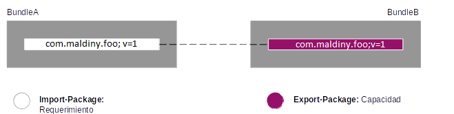
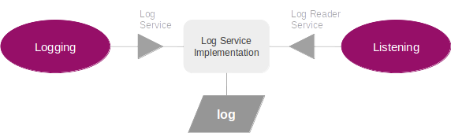

# OSGI-en-Castellano

## Índice
  1. introducción
  2. modularidad
  3. ciclo de vida
  4. principios de los servicios
  5. uso de componentes básicos

## Introducción

**OSGI (Open Services Gateway Initiative)**

Framework creado en Marzo de 1999 **orientado a Servicios** e implementado en Java, que define la forma de crear módulos y la forma en que estos interactúan entre sí en tiempo de ejecución. 

La **OSGi Alliance** es un consorcio de empresas tecnológicas a nivel mundial que trata de asegurar la interoperabilidad de las aplicaciones y servicios. Algunos ejemplos de miembros: Motorola, Nokia, Mitsubishi Electric Corporation, Vodafone Group Services, LinkedIn, LG Electronics...

Este framework provee al desarrollador de un entorno Java gestionado y seguro que permite el despliegue de aplicaciones denominadas **bundles**. El framework de OSGI permitirá la **descarga, instalación y borrado de bundles en tiempo de ejecución.**

OSGi intenta solventar los problemas del tradicional "classloader" de la máquina virtual y de los servidores de aplicaciones Java. Para ello, en OSGI **cada bundle tiene su propio classpath separado del resto de classpath de los demás módulos.**

La arquitectura OSGI se divide en capas, tal y como se muestra en la siguiente figura, las cuales se detallan a continuación:asd

<p align="center"></p>

* **Bundles**: Componentes OSGI creados por los desarrolladores.
* **Servicios**: Capa encargada de conectar distintos bundles de manera dinámica.
* **Ciclo de vida**: API que permite instalar, iniciar, parar, actualizar y desinstalar bundles sin necesidad de reiniciar el framework.
* **Módulos**: Capa que define cómo importar/exportar código fuente de un bundle.
* **Seguridad**: Capa que administra los aspectos de seguridad del framework.
* **Entorno de ejecución**: Especifica qué métodos están disponibles en la plataforma.

**[Ir al índice](#Índice)**

## Modularidad

### Modelos de dependencias

* El sistema debe resolver las dependencias del bundle, posiblemente en múltiples alternativas válidas de las cuales el sistema automáticamente **resolverá las dependencias con la mejor de las opciones posibles.**
* El modelo de resolución de dependencias dinámico de OSGI siempre encuentra el bundle que mejor encaja con cada invocación **en tiempo de ejecución.**
* OSGI recomienda la **dependencia a través de APIs.**
* Las APIs se definen **a nivel de paquetes.**
* Lee casi todos los JSR (**J**ava **S**pecification **R**equests). OSGI define los paquetes que JSR específica. Ej:
  * JSR 112 → javax.resource.spi, cci
  * JSR 173 → javax.xml.stream
  * JSR 315 → javax.servlet (3.0)

### Versionado semántico

<p align="center"></p>

* **Major**: Actualizaciones incompatibles para ambos, el consumidor y el publicador de la API.
* **Minor**: Actualizaciones compatibles para el consumidor pero no para el proveedor de la API.
* **Micro**: Actualizaciones que no afectan al API, por ejemplo, un fix.
* **Qualifier**: Un identificador como puede ser un timestamp.

**El consumidor de una API deberá importar un rango que comienza con la versión base y termina con la siguiente versión Major. Por ejemplo: [4.2,5)**

### Imports dinámicos

```css
DynamicImport-Package: *;vendor=acme, *
```

* Esta etiqueta contiene valores separados por comas, donde se indican los **paquetes que pueden ser importados dinámicamente** cuando sean necesarios. 
* Generalmente esta directiva se usa para **evitar dependencias cíclicas** cuando cargamos clases a través de Class.forName().
* Los paquetes pueden ser nombrados **explícitamente o** mediante el uso de **expresiones** como org.foo.* o *. 

### Cómo y cuando “the package wiring” ocurre

Un aspecto fundamental del framework de OSGI es la gestión de las dependencias entre bundles. Estas dependencias se expresan en el **MANIFEST.MF** y se pueden clasificar como **requerimientos y capacidades**.

El framework resuelve las dependencias durante la **fase de Resolución**. El framework debe resolver ser capaz de localizar una capacidad para cada requerimiento para poder declarar un bundle como **Resolved**.

Los paquetes se reflejan en el osgi.wiring.package. Un **Import-Package** se mapea en el osgi.wiring.package como un requerimiento mientras que un **Export-Package** se mapea como una capacidad.
* **Import-Package:** com.everis.foo; version=1
* **Export-Package:** com.everis.foo; version=1

<p align="center"></p>

### Entornos de ejecución

<p align="center"></p>

- Apache Felix
- Apache Karaf
- Equinox
- Jboss
- Knopflerfish
- ...

### Entornos de desarrollo

Para el desarrollo de bundles OSGI se recomienda disponer de los siguientes frameworks:

- **IDE** (Eclipse, Netbeans, IntelliJ,...): Como entorno de desarrollo.
- **Maven 3.0** para la gestión de dependencias y construcción de artefactos.
- **Maven-bundle-plugin** para la generación de los MANIFEST.MF a partir del pom.xml
- **Apache Felix** como entorno OSGI de despliegue de bundles.

<p align="center"></p>

Opcionalmente a estos componentes, nombrar la existencia del plugin de eclipse **BndTools** que nos facilitará numerosas **ventajas** para la generación de artefactos en el entorno de desarrollo:

- Análisis y resolución de dependencias.
- Repositorios locales de bundles.
- Versionado semántico de bundles.
- Construcción y despliegue instantánea.
- Testeo de bundles.

### Capacidades y requerimientos

Un aspecto esencial en el modelo de dependencias establecido en los framework basados en OSGI es el concepto de Namespace.

Un **Namespace define la relación existente entre una capacidad y un requerimiento**, un productor de un determinado servicio y un consumidor del mismo.

Por ejemplo:

```css
Proveedor: System Bundle
Provide-Capability: osgi.ee; osgi.ee="OSGi/Minimum"; version:List="1.0, 1.1, 1.2", osgi.ee; osgi.ee="JavaSE"; version:List="1.0, 1.1, 1.2, 1.3, 1.4, 1.5, 1.6"

Consumidor: Cualquier budle
Require-Capability: osgi.ee; filter:="(&(osgi.ee=JavaSE)(version=1.6))"
```

<p align="center"></p>

### Antipatrones

Los **antipatrones** son soluciones negativas que suelen presentar más problemas que soluciones. Su estudio permitirá conocer los errores más comunes con la arquitectura OSGI:

* **Class.forName()**

```java
Class clazz = Class.forName("org.example.domain.Event");
```

  1. Permite la carga de clases **sin especificar el ClassLoader** empleado y como único argumento el nombre de la clase.
  2. Utiliza el ClassLoader en ejecución que contiene la clase en la que se hace uso de la misma.
  3. Complejo de utilizar el OSGI ya que el **ClassLoader es independiente por cada Bundle.**
  4. Es necesario tener cargada la clase en el ClassLoader del Bundle por lo que será necesario especificar dicha dependencia en el MANIFEST.MF **Import-Package**.
  5. Susceptible a generar excepciones en tiempo de ejecución de tipo **ClassNotFoundException**.

* **Thread Context ClassLoader**

```java
ClassLoader tccl = Thread.currentThread().getContextClassLoader();
Class clazz = Class.forName("org.example.domain.Event", true, tccl);
```

  1. Es una de las soluciones **peor documentadas** de todas las especificaciones del J2EE.
  2. OSGI **no puede garantizar** que el hilo en ejecución es el que se encuentra en ejecución para un determinado código fuente.
  3. Los ClassLoaders en los hilos en OSGI no están definidos en las especificaciones de OSGI y su invocación **puede retornar “null”**.

### Antipatrones - Soluciones

* **Instanciación de objetos a través de una Factoría**

```java
public interface DomainObjectFactory {
    Object createInstance(String tableName);
}
```

  1. Evita la carga de clases dinámica por el classloader.
  2. Crea objetos bajo petición desde el bundle que contiene las clases necesarias para crearlo.
  3. No es válido para todos los casos de uso.

* **Registro de Clases**

```java
session.registerClassForTable("EVENTS", Event.class);
List events = session.createQuery("from Event").list();
session.registerClass("org.example.domain.Person", Person.class);
```

  1. El cliente antes de realizar la petición realiza el registro de las clases en el la sesión.
  2. Permite el registro de clases directamente utilizando únicamente su nombre.
  3. Una vez registradas en la sesión puede recuperarse con Class.forName.

* **Envío del ClassLoader**

```java
SessionFactory.createSession(MyClass.class.getClassLoader());
session.setDomainClassLoader(MyClass.class.getClassLoader());
```

  1. Es la opción con menor impacto en el código existente.
  2. Habrá que evaluar si esta opción se ajusta a las necesidades presentadas en cada caso.
  3. Se puede enviar “null” para indicar que el framework debe encontrar el ClassLoader adecuado.

**[Ir al índice](#Índice)**

## Ciclo de vida

### Bundle Manifest

- **Bundle-Activator:** Especifica el nombre de la clase que será invocada durante el arranque y la parada del bundle a los métodos respectivamente. Esta clase deberá implementar los métodos de BundleActivator start() / stop(). p.e.j: com.acme.fw.Activator
- **Bundle-Category:** Listado de categorías separados por coma al que pertenece el bundle. p.e.j.: osgi, test, nursery
- **Bundle-ClassPath:** Listado de jar separados por coma que serán cargados en el classpath del bundle durante su arranque. p.e.j: /jar/http.jar,.
- **Bundle-ManifestVersion:** Define el listado de reglas de especificación del bundle. p.e.j.: 2
- **Bundle-Name:** Define el nombre del bundle. p.e.j: Firewall
- **Bundle-SymbolicName:** Especifica el nombre identificativo único para el contenedor de bundles. p.e.j: com.acme.daffy
- **Bundle-Version:** Número de la versión del bundle. p.e.j: 1.1
- **Export-Package:** Listado de paquetes exportados por el bundle especificando la versión de forma opcional pero recomendable. p.e.j: org.osgi.util.tracker;version=1.3
- **Import-Package:** Listado de paquetes importados por el bundle necesarios para la ejecución del mismo. p.e.j: org.osgi.util.tracker,org.osgi.service.io;version=1.4

### Estados de un bundle

<p align="center"></p>

- **Installed:** El bundle se ha instalado satisfactoriamente.
- **Resolved:** Todas las clases de java necesarias están disponibles. Este estado indica que el bundle está listo para ser iniciado o detenido.
- **Starting:** El bundle está iniciándose. El método BundleActivator.start está siendo invocado y aún no terminado su ejecución. 
- **Stopping:** El bundle está deteniéndose. El método BundleActivator.stop está siendo invocado y aún no terminado su ejecución.
- **Active:** El bundle ha sido activado satisfactoriamente y está en ejecución. El método BundleActivator.start ha sido invocado y ha terminado su ejecución.
- **Uninstalled:** El bundle se ha desinstalado. No podrá cambiar de estado nuevamente.

### Bundle/BundleContext/BundleActivator

* **Bundle Simbolic Name (BSN) y Bundle Version**
El nombre y la versión especificada por el desarrollador. La combinación de ambos es el identificador único de un bundle en el framework.

> **getSymbolicName**: Obtiene el bundle name de un bundle.
> **getVersion**: Obtiene la versión de un bundle.

Es posible instalar el mismo bundle varias veces siempre y cuando esta pareja de valores no se encuentre ya desplegada en el framework.

* **Bundle location**

Nombre asignado por el framework en el momento de la instalación. Especifica la URL para localizar el JAR.

> **getLocation:** Obtiene la localización de un bundle (inputstream, OBR, URL,...)

* **Bundle ID**

Es un ID de tipo long asignado por el framework único para el bundle durante todo su ciclo de vida. Su propósito es identificar de forma única un bundle dentro del framework.

> **getBundleID:** Obtiene el identificador de un bundle.

### Bundle/BundleContext/BundleActivator

* **BundleContext**

Define la relación entre el estado actual del Framework y los bundles instalados en él. El BundleContext de un bundle se construye al iniciar un bundle. Entre otras operaciones, el BundleContext permitirá a un bundle realizar las siguientes operaciones:

  1. Instalar nuevos bundles en el Framework.
  2. Obtener información del resto de bundles desplegados en el Framework.
  3. Crear listeners, registrar servicios, acceder a servicios,...

* **BundleActivator**

La interfaz BundleActivator se invoca cuando un bundle se inicia o detiene en el contenedor. Por este motivo define los métodos start(BundleContext) y stop(BundleContext).

La clase que implementa la interfaz se define en el fichero MANIFEST.MF del siguiente modo:

```css
Bundle-Activator: com.everis.Activator
```

Los bundles de tipo Fragmento no disponen de un BundleActivator.

Se pueden definir diferentes políticas de activación (lazy, eager,...)

```css
Bundle-ActivationPolicy ::= policy ( ’;’ directive )*
policy ::= ’lazy’
```

### Refresco de un bundle

El refresco de un bundle **creará una nueva revisión del bundle** mientras el bundle existente siga conectado con otros bundles.

Estas revisiones antiguas del bundle pueden eliminarse del framework realizando la “limpieza” del framework invocando al método “**refreshBundles**(Collection, FrameworkListener,...).

El proceso de refresco **detendrá cualquier bundle que haga referencia** al bundle que se está refrescando almacenando su estado actual, de tal forma, que si en su configuración se define como “START_TRANSIENT”, tras el refresco pasará de nuevo a estado activo.

<p align="center"></p>

### System Bundle

- El system bundle es el bundle que representa el **framework** del contenedor.
- Siempre se le asignará como el bundle con **identificador cero (0).**
- Su ciclo de vida no es como el de resto de bundles.
  - **start**: No realiza nada porque el System bundle ya se encuentra en funcionamiento.
  - **stop**: Realiza la parada de todo el framework.
  - **update**: Para y reinicia el framework en otro hilo.
  - **uninstall**: Esta operación no se puede realizar. Retorna un BundleException.
- Provee un **servicio de tipo “Package Admin”** que provee acceso a las librerías internas del sistema.
- El **StartLevel** de este bundle es el **0** y no puede ser modificado.

<p align="center"></p>

### Bundles independientes del orden de inicio

Es posible en OSGI definir el orden en el que se inician los bundles en el framework a partir del **StartLevel** que tengan definidos. Esta solución no está recomendada ya que según se incrementa el número de bundles desplegados en el sistema se hace más difícil de mantener.

Una solución más recomendada es **crear cada bundle independiente del orden en el que se inician**. Para ello OSGI provee de los siguientes mecanismos:

* **Release 1:** OSGI envía eventos al registrar y desregistrar servicios. Mediante **ServiceListeners** será posible recibir estos eventos.

* **Release 2:** OSGI introduce el concepto de **ServiceTracker**. El ServiceTracker monitorizará el alta, modificación y borrado de servicios a partir de un filtro que se defina.

* **Release 4:** OSGI introduce el concepto de **DeclarativeServices**. Los DeclarativeService permitirán manejar de forma dinámica el registro de servicios de una forma más sencilla de implementar y mantener para el desarrollador. Adicionalmente, esta solución es más escalable al delegar la carga de clases y la creación de objetos al Framework.

### BundleTracker y ServiceTracker

* **BundleTracker**

	* El propósito del bundle tracker es simplificar el rastreo de eventos realizados sobre los bundles, principalmente el cambio de estado de los bundles, instalación, activación, parada, arranque,...

* **ServiceTracker**

  * El propósito del service tracker es simplificar el rastreo de referencias a servicios OSGI, los objetos de tipo ServiceReference. Sus argumentos son:
  
  	S- El tipo del servicio a rastrear.
	T - El tipo del servicio a rastrear.
    
<p align="center"></p>

**[Ir al índice](#Índice)**

## Principios de los servicios

### Servicios dinámicos

El contenedor Blueprint es el encargado de manejar de forma dinámica la construcción y destrucción de servicios en un framework OSGI.

* **Referencia a Proxys:** El manejador de servicios ante la solicitud de un servicio debe proveer de un servicio que cumpla la interfaz solicitada en un determinado periodo de tiempo a través de un proxy al servicio expuesto. En el momento en el que el servicio deje de estar disponible, el proxy generará una excepción de tipo “ServiceUnavailableException”.

* **Registro condicional de servicios:** El manejador de servicios es responsable de registrar los servicios en el Registro de Servicios de OSGI. En caso de que el manejador de servicios detecte que alguna dependencia obligatoria no ha sido resuelta el servicio no será registrado ni ninguno de sus servicios.

Al invocar un servicio desde un Bundle, éste se bloqueará hasta que el framework sea capaz de satisfacer la petición o bien, se descartará al superar el timeout (cinco minutos).  (0=Infinito)

```xml
<reference id="logService" interface="org.osgi.service.log.LogService" timeout="100000" />
```

Las dependencias obligatorias han de ser resueltas en primer lugar para poder resolver o crear el resto de servicios por el manejador de servicios. Por ejemplo en el siguiente caso, el servicio “S” no podrá construirse hasta que se obtenga el servicio “M”:

“S” no se creará hasta que “M” se resuelva:

```xml
<service id="S" ref="A" interface="com.acme.Foo"/>
<bean id="A" class="com.acme.FooImpl"><property name="bar" ref="m"/></bean>
<reference id="M" interface="com.acme.Bar" availability="mandatory"/>
```

### Filtros LDAP y propiedades de los servicios

Los filtros LDAP vienen definidos por la RFC2254 y se emplean en OSGI por ejemplo para crear máscaras en la carga de ficheros de propiedades. Un resumen de su sintaxis es el siguiente:

* El operador AND, OR y NOT se representa por “&”, “|” y “!” respectivamente.
* El “=” representa comparación de igualdad para las expresiones de nombre/valor.
* El comodín se representa por un “*”.

Como se puede ver en el siguiente ejemplo, el filtro es: **(.*\\.jar|.*\\.cfg)**

<p align="center"></p>

Esto indicará al servicio de configuración que será necesario cargar en el directorio especificado todos aquellos ficheros cuya extensión sea **“.jar” o “.cfg”** independientemente de cual sea su nombre especificado por “.*” que indica uno o más caracteres sea cual sea.

Se utilizará el **carácter especial “\\”** para especificar el carácter “.” como tal y no su significado en el lenguaje LDAP.

### Alternativas a los servicios dinámicos

Al recuperar servicios en OSGI puede ocasionar **errores** ocasionados por las siguientes casuísticas:

- Los bundles que los publican no se hayan desplegado.
- Los servicios no se hayan registrado.
- Se hayan detenido los bundles que publican los servicios....

Una posible **solución** sería crear listeners para buscar directamente la referencia a los servicios del siguiente modo:

1. **Recuperar todos** los servicios registrados.
2. Registrar un **ServiceListener** para monitorizar los cambios que se produzcan.

**Problema:** Entre el paso 1 y el paso 2 se pueden registrar servicios.
**Solucion+Problema:** Invertir el orden de los pasos. Esto puede generar el registro por duplicado del mismo servicio.

### Declarative Service intermediario con la capa de servicios 

1. Module Layer: Define el modelo de modularización, Este módulo define la reglas para el intercambio de paquetes java entre los Bundles. 

<p align="center"></p>

2. Service Layer: La capa de servicios proporciona un modelo programación dinámico para los desarrolladores de bundles, simplificando el desarrollo y despliegue de módulos a través del desacople de la especificación del servicio (java interface), de su implementación. 

<p align="center"></p>

> Solución: Crear ServiceTrakers o referenciar los servicios mediante Declarative Services.

**[Ir al índice](#Índice)**

## Uso de componentes básicos

### Log Service

> Ver ejemplo Log Service

- LogService provee de un sistema de log común para el framework OSGI.
- El bundle LogService facilita dos servicios:
  - Escritura de Log: Destinado a insertar nuevas ocurrencias en el log.
  - Lectura de Log: Destinado a recuperar el log.
- Mediante el **LogReaderService** se permite recibir objetos de tipo LogEntry en el momento de ser generados.
- Se facilita de una interfaz gráfica para consultarlos en tiempo real.

<p align="center"></p>

### HTTP Service

> Ver ejemplo HTTP Service

- Facilita los protocolos de comunicación HTTP, HTML, XML y servlets a los bundles para que puedan interactuar remotamente con los servicios que exponen.
- El **HTTP Service** soporta dos estándares:
  - **Registrar servlets:** Registrar un objeto Java que implementa el Java Servlet API.
  - **Registrar recursos:** Registrar un HTML, una imagen o cualquier otro recurso estático.
- HTTP Service soporta al menos la versión 2.1 de Java Servlet API.

<p align="center"></p>

### Configuration Admin Service

> Ver ejemplo Configuration Admin Service

El servicio de configuración de OSGI establece un **mecanismo de administración, gestión y acceso centralizado a las propiedades** cargadas en el framework.

- La configuración se puede cargar a partir de su definición en un **fichero “.cfg”**. 
- Se puede crear **programáticamente** en tiempo de ejecución.

1. Alta de un recurso de propiedades:

```java
Dictionary properties = new Hashtable();
properties.put("service.pidySmsService");
registration = context.registerService(ManagedService.class.getName(), 
                         new SmsService(), properties);
```

2. Acceso a un recurso de propiedades:

```java
ServiceReference caRef = bundleContext.getServiceReference(ConfigurationAdmin.class.getName());
ConfigurationAdmin configAdmin = (ConfigurationAdmin)  bundleContext.getService(caRef);  
Configuration config = configAdmin.getConfiguration("mySmsService");
Dictionary props = config.getProperties();
props.put("keyalue"); // Codificación de las propiedades
config.update(props); // Persistencia del cambio en el servicio de configuración
```

<p align="center"></p>

### Declarative Services

> Ver ejemplo Declarative Service

Permite realizar la declaración de servicios OSGI a través de un XML utilizando el framework de OSGI a partir de la versión 4.0.

```xml
<component name="productor.impl.ProductorImpl"> 
	<implementation class="productor.impl.ProductorImpl"/> 
	<service> 
		<provide interface="productor.Productor"/> 
	</service> 
</component>
```

```java
@Component
public class Consumidor {
	
	Productor productor;

	@Reference(name="productor", service=Productor.class)
	public void setProductor(Productor productor) {
		this.productor = productor;
	}
}
```


**[Ir al índice](#Índice)**

## Referencias

- OSGI Alliance: http://www.osgi.org/
- OSGI Especificaciones: https://osgi.org/download/r6/osgi.core-6.0.0.pdf
- Apache Felix: http://felix.apache.org/
- Apache Karaf: http://karaf.apache.org/
- BndTools: http://bndtools.org/
- aQute: http://www.aqute.biz/Bnd/Bnd
- The OSGi μservice model: https://jaxenter.com/osgi-enroute-a-new-framework-for-osgi-applications-117514.html 
- Introduction to OSGI: https://jaxenter.com/a-gentle-introduction-to-osgi-103732.html

**[Ir al índice](#Índice)**
